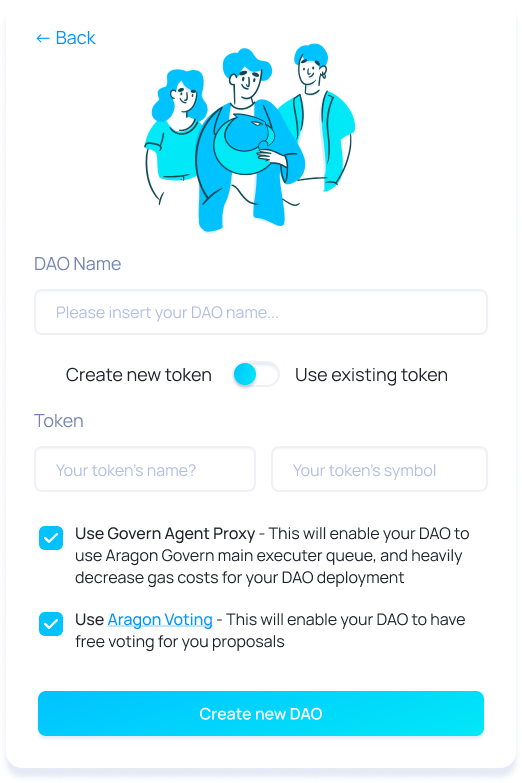

# Getting Started

You've never worked with DAOs before? You've never created one? No problem, we got you covered. In this guide, we'll walk you through everything Aragon V2 has to offer. We'll cover:

- Prerequisites
- Creating a DAO
- Creating proposals for your DAO and voting on them
- Scheduling, challenging, and executing actions for your DAO

This should be a user-friendly guide to get you started in the DAO universe. If you want to learn more about the technical aspect of things, please visit the other sections of this documentation.

## Prerequisites

- An Ethereum wallet.
- ...

## Creating a DAO

Nothing beats the freedom, extensibility, and showing-off factor of a good old command-line interface. Except if you've never used them before. That's why we've designed a graphical user interface for you. If you prefer buttons to cryptic shell commands, head on over to the [Govern console](https://console-rinkeby.aragon.org/). After connecting your wallet in the upper-right corner, click "create DAO". This will take you to a dialogue that will guide you through creating your first DAO.

  

As you can see in the illustration, you will be asked to enter your DAO's name. You will also be presented with the choice to create a new token or to use an existing token. In the first case, you'll have to provide a name and a symbol (< 5 letters) for your new token. In the second case, you'll have to specify the address of the token you want to use for your DAO. In both cases you'll also be able to choose whether or not you want to include Aragon Voting - Aragon's tech component for voting (read up on it [here](https://)). It will also ask you whether you want to use Govern's Agent Proxy. To make sure you unlock all Govern has to offer, we advise you to choose both.

Once you've entered all the necessary information, hit the `Create new DAO` button. Wait for the transactions to go through and ... done! Congratulations, you've just created your first DAO.

## Proposals and Voting

An important part of governing a DAO is to enable its community to create proposals and to vote on them. If you chose to use Aragon Voting when creating your DAO, this section will explain how you can create proposals and vote on them.

### Register Your Token

To get started, go to the [Aragon Voting](https://bridge.dev.vocdoni.net/) page and connect your wallet. Once that's done, the next step depends on whether or not your DAO's token is already registered with Aragon Voting. If you've created a new token for your DAO, the answer is, most likely, no. In any case, you can check by clicking `Find Tokens` in the navigation bar. If you don't find your token there, click on the `My token is not listed` link. This will take you to a page where you can register your token. To do so, simply enter your token's contract address. The page will prompt you to confirm that you're registering the correct token. If that's the case, confirm. Voilà, your DAO is now ready to receive proposals!

### Create a Proposal

Once you've registered the token, it should pop up under `Find Tokens`. In order to create proposals, click on your token. This will take you to your token's _Token Details_ page. To create a new proposal, click the `Create Governance Process` button. This will present you with a form where you can fill out all the necessary information for a proposal. Note that a proposal consists of:

- A short title
- A comprehensive description
- A voting window
- A number of questions, each containing:
  - A short title
  - A comprehensive description
  - A number of choices to vote for.

Complete the process by submitting it.

> Note: You can add any number of questions to a proposal, and each question can have any number of choices.

### Vote on proposals

On the _Token Details_ page, you will find all the active proposals for a particular token. Clicking on a proposal will take you to a page where you can see the details of that proposal, and vote on it.

You can also go to your _Dashboard_ to see proposals related to your token.

## Scheduling, Challenging & Executing Actions.

Coming soon.
