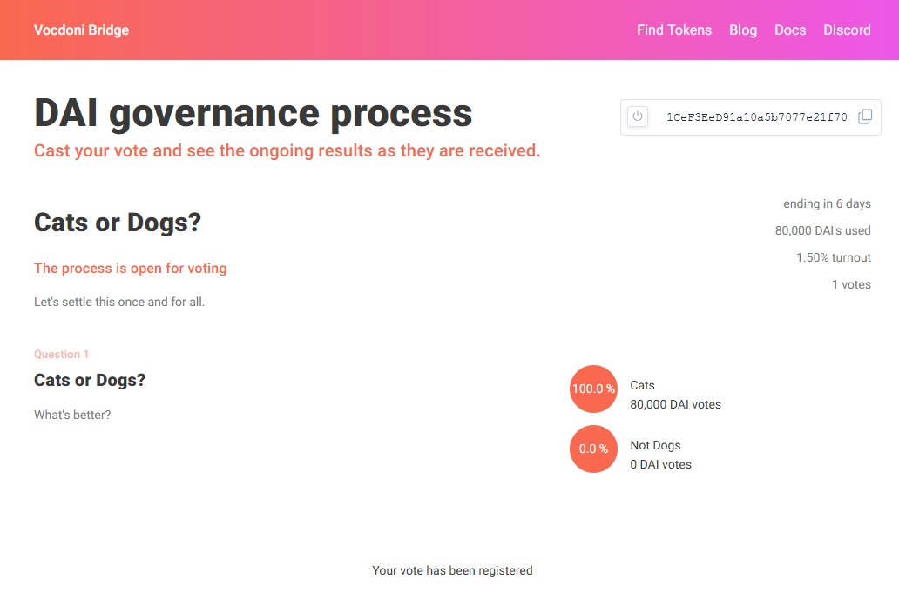

# Getting Started

Welcome to Aragon V2, the leading framework for creating and managing _decentralized
anonymous organizations_ (DAO).

You've never worked with DAOs before? You've never created one? No problem, we got you
covered. In this guide, we'll walk you through everything Aragon V2 has to offer. We'll
cover:

- Prerequisites
- Creating a DAO
- Creating proposals for your DAO and voting on them
- Scheduling, challenging, and executing actions for your DAO

This is meant to be a user-friendly guide to get you started in the DAO universe. If you
want to learn more about the technical aspect of things, please visit the other sections
of this documentation.

## Prerequisites

- An Ethereum wallet.
- ...

## Creating a DAO

Nothing beats the freedom, extensibility, and showing-off factor of a good old
command-line interface. Except if you've never used them before. That's why we've designed
a graphical user interface for you. If you prefer buttons to cryptic shell commands, head
on over to the [Govern console](https://console-rinkeby.aragon.org/). After connecting
your wallet in the upper-right corner, click "create DAO". This will take you to a
dialogue that will guide you through creating your first DAO.

  

As you can see in the illustration, you will be asked to enter your DAO's name. You will
also be presented with the choice to create a new token or to use an existing token. In
the first case, you'll have to provide a name and a symbol (< 5 letters) for your new
token. In the second case, you'll have to specify the address of the token you want to use
for your DAO. In both cases, you'll also be able to choose whether or not you want to
include Aragon Voting - Aragon's tech component for voting (read up on it
[here](https://)). It will also ask you whether you want to use Govern's Agent Proxy. To
make sure you unlock all Govern has to offer, we advise you to choose both.

Once you've entered all the necessary information, hit the `Create new DAO` button. Wait
for the transactions to go through and ... done! Congratulations, you've just created your
first DAO.

## Proposals and Voting

An important part of governing a DAO is to enable its community to create proposals and to
vote on them. Assume, for example, that you want to acquire some asset for your DAO, using
your DAO's funds. You have done your research and think that this asset will positively
impact your DAO. However, the point of having a DAO, is that no single member should have
the authority to decide whether this is true or false. With Aragon Voting, we provide you
with a tech component that allows you to do just that: Create a proposal and put it to a
vote.

### Register Your Token

To get started, go to the [Aragon Voting](https://bridge.dev.vocdoni.net/) page and
connect your wallet. Successfully connecting to your wallet will automatically forward you
to your _Dashboard_ page, where you'll see active, closed, and upcoming votes. If you've
only just created your DAO with a new token, you will probably not see your token there.
The reason for this is that you must first register your token with the voting app.

  

To register your token, click `Find Tokens` in the navigation bar. This will take you to
the _Tokens_ page you see above. On it, you will see all active tokens registered with the
side. Click on the `My token is not listed` link to get to the page where you can register
your token.

  

To do so, simply enter your token's contract address and hit `Check token`. The page will
give you details about your token and prompt you to confirm that you're registering the
right token. If that's the case, hit `Register token`. Voilà, your DAO is now ready for
voting!

### Create a Proposal

Once you've registered the token, it should pop up under `Find Tokens`. In order to create
proposals, click on your token. This will take you to your token's _Token Details_ page.
To create a new proposal, click the `Create Governance Process` button. This will present
you with a form where you can fill out all the necessary information for a proposal. Note
that a proposal consists of:

- A short title
- A comprehensive description
- A voting window
- A number of questions, each containing:
  - A short title
  - A comprehensive description
  - A number of choices to vote for.

Complete the process by submitting it.

> Note: You can add any number of questions to a proposal, and each question can have any
> number of choices.

> Note: **Creating a proposal incurs gas fees**. However, once the proposal is created,
> **voting on a proposal is free** for everyone. We'll explain why this is necessary in
> the next section.

### Vote on proposals

On the _Token Details_ page, you will find all the active proposals for a particular
token. Clicking on a proposal will take you to a page where you can see the details of
that proposal, and vote on it.

  

  

You can also go to your _Dashboard_ to see proposals related to your token.

## Scheduling, Challenging & Executing Actions.

Govern, as the name suggests, is all about a DAO's community taking _actions_ to govern
that DAO. So far, we've seen how a DAO member can initiate change by creating a proposal
for token holders to vote on. You might wonder what a vote has to do with actually taking
_action_. The answer is that Govern gives you the ability to tie on-chain actions to
various outcomes of a proposal.

### Scheduling

Remember the asset you wanted to acquire in the previous section? In Govern, you can tie
the acquisition of that asset to a positive outcome of the vote. This is what's called
_scheduling_ an action.

Unfortunately, scheduling an action can currently not be done from within the voting app.
Instead, you have to go back to the [Govern console](https://console-rinkeby.aragon.org/).
Navigate to your DAO and click on the `New Proposal` Button. As is shown in the first
illustration below, this will take you through a dialogue where you can register a
proposal and attach actions to it.

  

  

As you can see in the second illustration above, each action is a pair of

- Function ABI
- The address of the contract where that function is to be executed

You can attach any number of actions to a proposal.

### Challenging

Proposing actions is all well and good, but it doesn't cover all aspects of governance.
Every organization comes with a set of rules that determine what the organization's goals
are, how the organization is structured, a set of permission defining who is allowed to do
what, and more. Let's see how this relates to our asset acquisition example. Maybe your
DAO has a set of rules stating that you do not have permission to take some of the action
tied to the proposal. In this case, the proposal should be declared moot. But how can this
be done? In this case, we could imagine a set of permission that can be checked when the
actions are scheduled. But in general, this is not a problem that can be solved using
programming and automation. The reason for this is that the set of rules that govern a DAO
are defined in a human-readable form. Even worse: they are, by nature, subjective. In
order to solve this problem, Aragon comes with a dispute resolution component called
[Govern Court](https://). To use it, a member of the DAO has to _challenge_ a proposal.

  

Challenging a proposal can be done from within the [Govern
console](https://console-rinkeby.aragon.org/). To do so, navigate to your DAO and click on
the proposal you want to challenge. This will take you to a detailed view of the proposal.
On the right-hand side, you'll find a dialog where you can enter your rationale for the
challenge.

> Note: This system of proposals and challenges is "optimistic". This is akin to "innocent
> until proven guilty". Every proposal is thought to be aligned with the DAO's rules.

> Note: To avoid abuse of both the proposal and the challenge mechanism, there is a
> monetary collateral tied to it. This should discourage challenging correct proposals, as
> the challenger would have to pay if the court decides against the challenger. The same
> goes for proposals. Proposals that go against the rules would incur a monetary penalty
> if the court decides against the proposer.

### Executing

Let's recap. So far, we've seen that we can govern a DAO by proposing actions that are
tied to a vote. We've seen that these proposals can be challenged if they are not aligned
with the DAO's terms.

Let's also go back to our asset acquisition example. Let's assume that it has successfully
passed a vote and that it did not violate any of the DAO's terms. I.e., it either did not
get challenged or the challenge got resolved in our favor. The last missing step is to
_execute_ the acquisition.

To execute an action, go to the [Govern console](https://console-rinkeby.aragon.org/),
navigate to your DAO, and find the corresponding proposal. On the proposals detail view,
just below the `challenge` dialogue, you'll find a button labeled
`Execute`.Congratulation, you've just successfully completed your first action to govern
your DAO!
